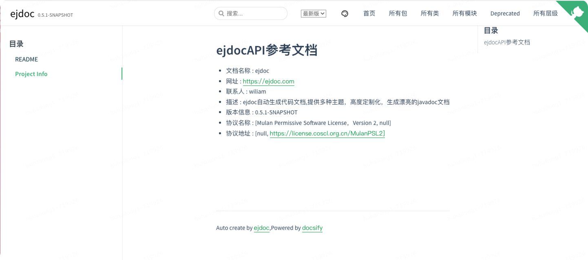
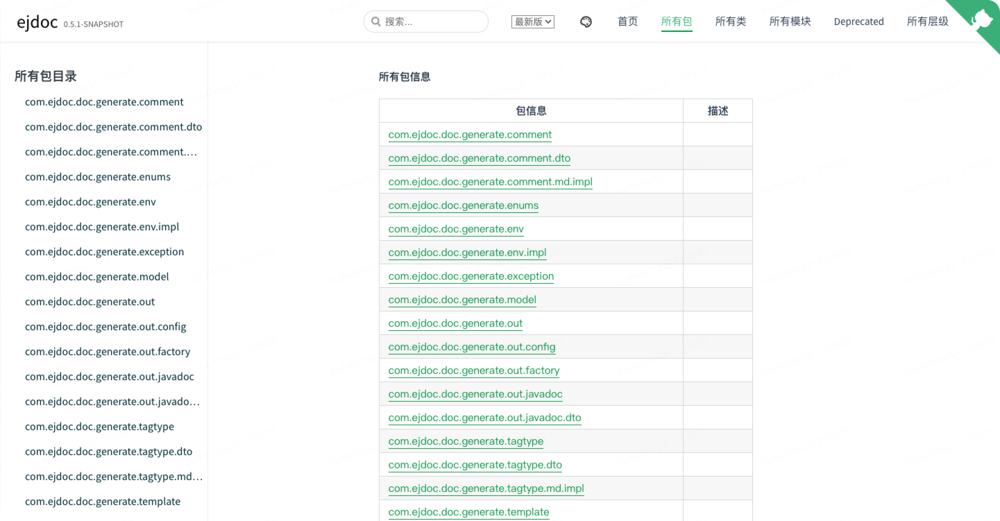
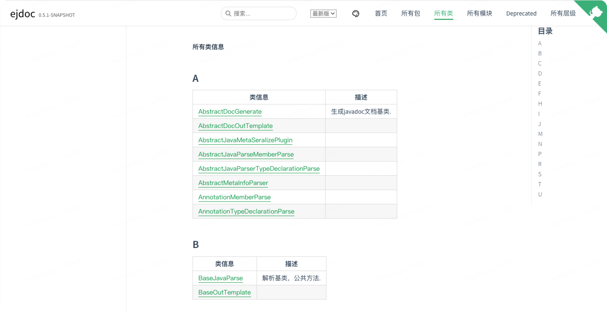
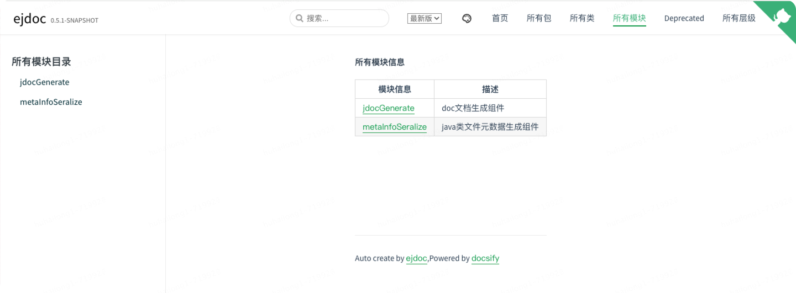
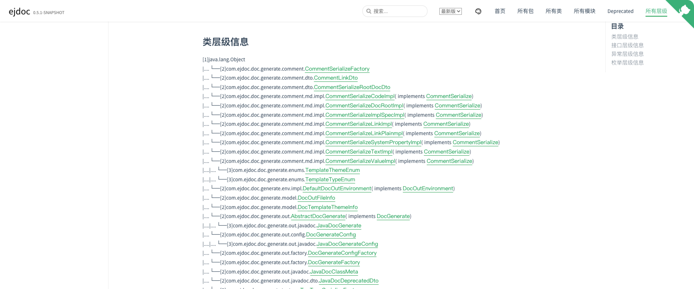

# ejdoc
## 简介
ejdoc提供基于现有的javadoc无侵入简单生成api文档，目前支持一键生成javadoc文档,API文档。

原生的javadoc样式一直没什么改变，现在前端的发展这么迅速，所以有了利用现在的前端技术重新生成javadoc与API文档的想法，ejdoc就是此想法的实现。

ejdoc充分利用前端的技术，将样式与数据抽离，按照自己想要的样式生成javadoc，充分利用现有的前端技术发展的成果。

## ejdoc名称的由来
ejdoc简单快速生成doc文档，javadoc文档和API文档等，让开发更专注，写代码同时就将文档写好了，提高开发效率。

## 包含组件

| 模块               | 介绍                                                     |
|------------------|--------------------------------------------------------|
| metaInfoSeralize | java元数据生成模块，使用json文件，对java文件的基本结构进行描述                  |
| jdocGenerate     | 使用metaInfoSeralize模块生成java代码json样式虚拟语法树，生成各种doc文档 |

## 文档

<a href="/refdoc/index.html" target="_blank">参考文档</a>  
<a href="/api/doc/markdown/index.html" target="_blank">API文档</a>

## 效果样例

[API文档样例](http://wiliam.me/ejdoc/api/doc/markdown/index.html)

### docsify主题

